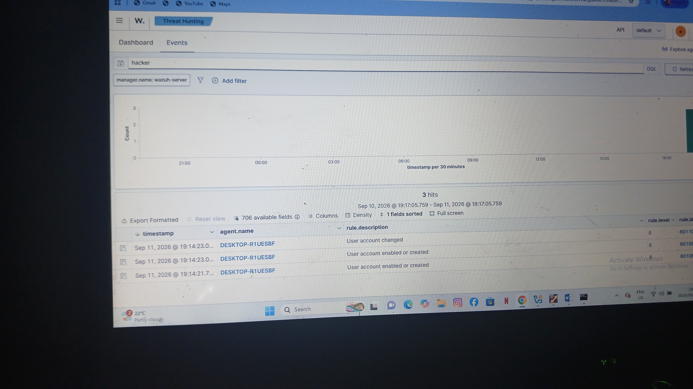

# 🛡️ Wazuh SIEM Lab - SOC Analyst Project

**Analyst:** Respect Khoza | TheGreatRancho
**Lab Environment:** Wazuh Manager (Ubuntu) + Windows 10 Agent (DESKTOP-R1UESBF)

### 📋 Overview
This lab demonstrates real-world threat detection using Wazuh SIEM. I simulated attacks on Windows and documented how Wazuh detects them in real-time. This is for my SOC Analyst portfolio.

### 🔍 Tasks Completed

#### **Task 1: Brute Force / Failed Logins**
- Simulated multiple failed logins on Windows
- Wazuh detected: Event ID 4625, Rule 60122 - Multiple authentication failures
- [View Task 1 Details](Task-Failed-Login/README.md)

#### **Task 2: Unauthorized User Creation (Persistence)**
- Simulated attacker creating a new local user: `net user testuser /add`
- Wazuh detected: Event ID 4720 - A user account was created
- [View Task 2 Details](Task-User-Creation/README.md)

#### **Task 3: User Account Enabled (testuser)**
- Enabled/disabled user account
- Wazuh detected user account status change
- Evidence in Wazuh dashboard

### 🛠️ Tools Used
- Wazuh 4.x, Windows Security Events, Sysmon, VirtualBox, GitHub

### 📸 Evidence
Each task folder contains screenshots from Wazuh dashboard showing detection.

---
*This is a growing lab - more detections will be added. Follow my journey to SOC Analyst!*
