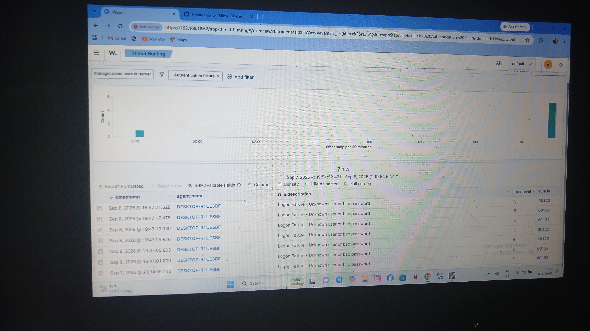

# Task 1: Failed Login / Brute Force Detection

### Scenario
Simulated multiple failed login attempts on DESKTOP-R1UESBF to test Wazuh detection for brute force.

### How I Simulated It
- Attempted to login with wrong password 5+ times on Windows account
- Used user: testuser / Administrator

### Wazuh Detection
**Event ID:** 4625 (An account failed to log on)
**Rule ID:** 18107 - Multiple authentication failures
**Severity:** High

Wazuh triggered alert after multiple failed attempts from same source.

### SOC Analysis
1. Check source IP / user
2. If brute force confirmed -> block IP, reset password
3. Check if any successful login followed (4624 after 4625 = breach!)

### Evidence
(Screenshot of Wazuh dashboard showing 4625 events)

